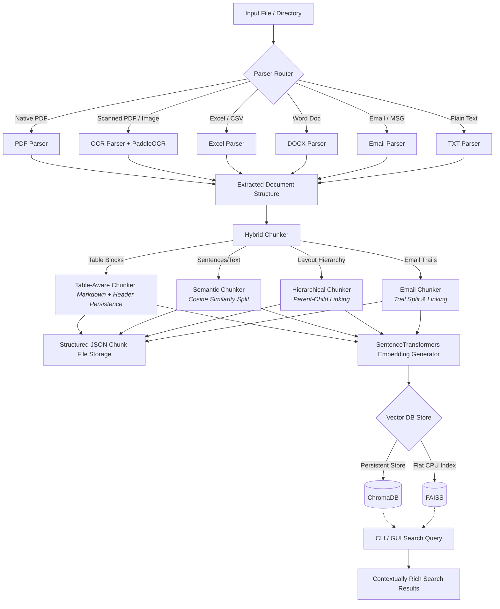

# KChunker: Project Overview & Process Flow

KChunker is a lightweight, ultra-fast, layout-aware intelligent document parsing, chunking, and indexing engine. It is designed for Retrieval-Augmented Generation (RAG) applications to ingest complex business documents (like PDFs, Excel sheets, Word files, emails, and images), structure them contextually, and index them locally for fast, high-accuracy semantic search.

---

## 1. What KChunker Does

* **Layout-Aware Parsing**: Extracts paragraphs, tables, and OCR coordinates rather than reading flat text.
* **OCR Fallbacks**: Transcribes scanned PDFs and images using PaddleOCR or local fallbacks.
* **Advanced Chunking**:
  * **Table-Aware**: Converts tables to Markdown format while maintaining header rows to avoid splitting tables across chunk boundaries.
  * **Semantic Splitting**: Splits text based on embedding cosine similarity (topic shifts) rather than simple token counts.
  * **Hierarchical Chunking**: Connects parent and child chunks, preserving document context.
  * **Email Trails**: Identifies and splits message threads, saving sender/recipient/timestamp metadata.
* **Local Indexing**: Generates embeddings using a local Hugging Face `SentenceTransformers` model and indexes them into **ChromaDB** or **FAISS** vector databases.

---

## 2. Process Flow Architecture

The diagram below outlines the lifecycle of a document processed through KChunker:



### Ingestion & Parsing
* **File Routing**: Files are evaluated for MIME type/extension and routed to the corresponding parser plugin.
* **OCR Scanning**: Scanned pages are rendered to images and run through OCR to capture spatial coordinates (bounding boxes).

### Chunking & Context preservation
* The `HybridChunker` coordinates the extraction process:
  * Tables are parsed intact.
  * Paragraphs are clustered.
  * Headers, sections, and metadata (like RFQ references) are inherited by all child chunks.

### Vector Storage & Search
* Chunks are encoded via `BAAI/bge-small-en` embeddings.
* Chunks are saved locally to `storage/` as structured JSON, while their embeddings and metadata are loaded into ChromaDB or FAISS.
* A user query returns matching chunks formatted with metadata (Page number, RFQ code, source file).

---

## 3. How to Launch and Use

### Installation
Ensure dependencies are set up using `uv`:
```bash
uv sync
```

### CLI Commands
* **Ingest a document**:
  ```bash
  PYTHONPATH=. .venv/bin/python main.py --file <path_to_document> --db <chromadb|faiss>
  ```
* **Search query**:
  ```bash
  PYTHONPATH=. .venv/bin/python main.py --query "your question" --db <chromadb|faiss>
  ```

### GUI Dashboard Shortcuts
You can open the management dashboard using any of these routes:

1. **CLI Flag**:
   ```bash
   uv run python main.py --gui
   ```
2. **Shortcut Script**:
   ```bash
   ./gui
   ```
3. **Package Command**:
   ```bash
   uv run kchunker-gui
   ```
4. **Finder Launcher**: Double-click `launch_gui.command` on macOS.
