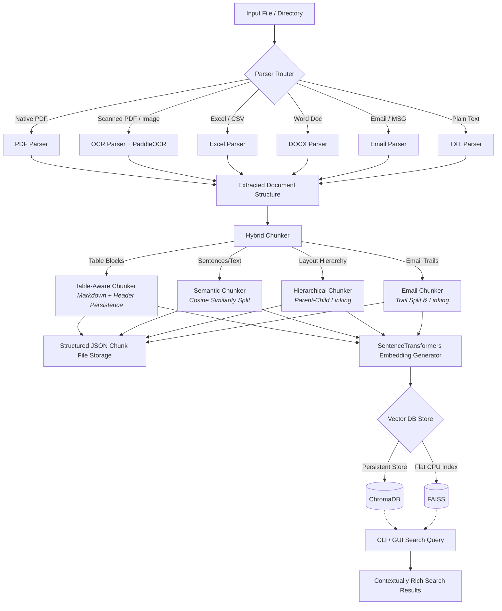

# KChunker

KChunker is a lightweight, ultra-fast, terminal-first intelligent document chunking engine designed for industrial RFQ processing and Retrieval-Augmented Generation (RAG) systems.

## Core Features
* Automatic document classification and parser routing.
* Semantic, hierarchical, table-aware, layout-aware, and email-thread chunking strategies.
* Metadata preservation and enrichment.
* Embedding generation and local indexing via FAISS and ChromaDB.

## Process Flow Architecture

The diagram below outlines the lifecycle of a document processed through KChunker:



## Installation & Setup

### macOS & Ubuntu (Linux)
You can set up KChunker automatically using the installer script, or run manual setup commands:

* **Automatic Shortcut**:
  ```bash
  ./install.sh
  ```
* **Manual Setup**:
  1. Install `uv` if you haven't:
     ```bash
     curl -LsSf https://astral.sh/uv/install.sh | sh
     ```
  2. Sync dependencies:
     ```bash
     uv sync
     ```

### Windows OS
You can install dependencies automatically via the batch installer or perform manual commands:

* **Automatic Shortcut**:
  Double-click `install.bat`
* **Manual Setup**:
  1. Open PowerShell and run to install `uv`:
     ```powershell
     irm https://astral.sh/uv/install.ps1 | iex
     ```
  2. Sync dependencies:
     ```powershell
     uv sync
     ```

---

## Running the CLI

### macOS & Ubuntu (Linux)
```bash
uv run python main.py --file <path_to_document>
```

### Windows OS
```cmd
uv run python main.py --file <path_to_document>
```

## Running the GUI Dashboard
You can launch the interactive Dear PyGui dashboard using any of the following shortcuts:

1. **CLI Flag Shortcut**:
   ```bash
   uv run python main.py --gui
   # Or with auto-ingestion:
   uv run python main.py --gui --file <path_to_document>
   ```

2. **Project Root Shortcut Script (macOS / Linux)**:
   ```bash
   ./gui
   # Or with auto-ingestion:
   ./gui --file <path_to_document>
   ```

3. **Package Manager Script Entrypoint**:
   ```bash
   uv run kchunker-gui
   ```

4. **Double-Clickable GUI Shortcuts**:
   * **macOS**: Double-click `launch_gui.command`. It opens Terminal, prompts for a file path (optional), and runs the dashboard.
   * **Windows OS**: Double-click `launch_gui.bat`. It opens the Command Prompt, prompts for a file path (optional), and launches the dashboard.
   * **Ubuntu / Linux**: Run `./launch_gui.sh` or double-click it. It opens Terminal, prompts for a file path (optional), and starts the dashboard.


