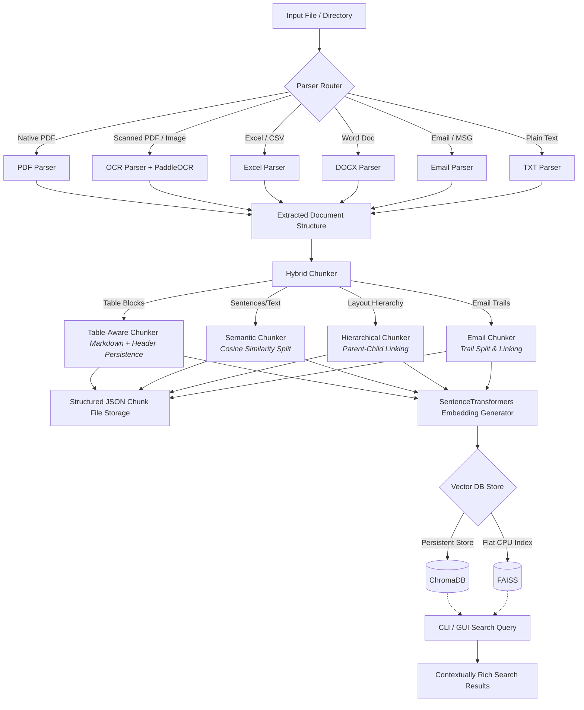

# KChunker

KChunker is a lightweight, ultra-fast, terminal-first intelligent document chunking engine designed for industrial RFQ processing and Retrieval-Augmented Generation (RAG) systems.

## Core Features
* Automatic document classification and parser routing.
* Semantic, hierarchical, table-aware, layout-aware, and email-thread chunking strategies.
* Metadata preservation and enrichment.
* Embedding generation and local indexing via FAISS and ChromaDB.

## Process Flow Architecture

The diagram below outlines the lifecycle of a document processed through KChunker:



## Installation & Setup
Ensure you have `uv` installed:
```bash
curl -LsSf https://astral.sh/uv/install.sh | sh
```

Install the dependencies:
```bash
uv sync
```

## Running the CLI
```bash
uv run python main.py --file <path_to_document>
```

## Running the GUI Dashboard
You can launch the interactive Dear PyGui dashboard using any of the following shortcuts:

1. **CLI Flag Shortcut**:
   ```bash
   uv run python main.py --gui
   # Or with auto-ingestion:
   uv run python main.py --gui --file <path_to_document>
   ```

2. **Project Root Shortcut Script**:
   ```bash
   ./gui
   # Or with auto-ingestion:
   ./gui --file <path_to_document>
   ```

3. **Package Manager Script Entrypoint**:
   ```bash
   uv run kchunker-gui
   ```

4. **macOS Double-Clickable Command**:
   Simply double-click the `launch_gui.command` file in Finder. It will open Terminal, let you drag-and-drop a file path, and start the GUI dashboard.

