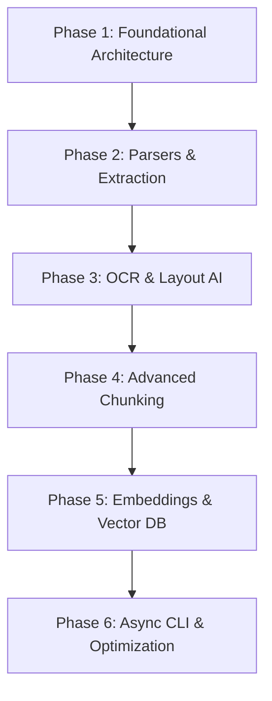
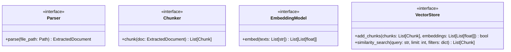

# KChunker Architectural Analysis & Implementation Plan

KChunker is a lightweight, high-performance, terminal-first intelligent document chunking engine designed for industrial RFQ processing and Retrieval-Augmented Generation (RAG) systems. This document outlines the architectural analysis, implementation phases, directory structure, dependency layout, and core interfaces for the project.

---

## 1. Architectural Analysis

The system must automatically handle multiple ingestion formats (Native/Scanned PDF, Excel BOMs, email trails, DOCX, TXT, images) and produce semantic, hierarchical, layout-aware, and table-aware chunks enriched with metadata. It must persist chunks locally as JSON and index them in a local vector database (FAISS or ChromaDB).

### System Decomposition
1. **CLI / Entrypoint**: Python CLI providing execution control (`--file`, `--dir`, config overrides).
2. **Workflow Manager**: Async orchestration coordinating document detection, parsing, OCR, chunking, embedding generation, and vector indexing.
3. **Config System**: Pydantic-based configuration containing thresholds, file-specific parameters, and path configurations.
4. **Logging System**: Structured, high-performance logging via `structlog`.
5. **Plugin/Parser System**: Extensible plugin manager that loads components dynamically.
6. **Parser Router**: Classifier that detects MIME types and routes to native or OCR-based parsing pipelines.
7. **Chunking Engine (Core)**: Custom hybrid chunker prioritizing layout hierarchy, table structures, and semantic coherence without splitting table rows or losing engineering units.
8. **Embedding Service**: Wrapper for Sentence-Transformers supporting models like BAAI/bge-m3.
9. **Vector Store Abstraction**: Adapters for FAISS and ChromaDB supporting metadata filtering and relationship retrieval.

---

## 2. Implementation Phases



### Phase 1: Foundational Architecture (Current Phase)
* Initialize dependency structure via `pyproject.toml` managed by `uv`.
* Create project directory skeleton.
* Implement config system (`configs/config.py`) using Pydantic Settings.
* Implement structured logging system (`utils/logging.py`) using `structlog`.
* Define base interfaces (`Parser`, `Chunker`, `Embedding`, `VectorStore`, `Plugin`).
* Implement lightweight plugin registration system (`plugin_system/manager.py`).
* Implement Document Classifier and Parser Router skeleton.
* Create Workflow Manager orchestration skeleton.

### Phase 2: Text Extraction & Routing (Parsers)
* Implement native text/layout extractors:
  * PDF Parser (`PyMuPDF` + `pdfplumber`).
  * Excel/BOM Parser (`pandas` + `openpyxl`).
  * DOCX Parser (`python-docx`).
  * Email Parser (`email` module) parsing revision chains.
  * Plain text Parser.

### Phase 3: OCR & Layout AI
* Implement OCR Parser plugin wrapping `PaddleOCR`.
* Implement layout segmenter using `DeepDoctection` or coordinate-aware parsing.
* Implement table extraction fallback using `Camelot` or `pdfplumber`.

### Phase 4: Advanced Chunking Engine
* Implement custom Hybrid Chunker:
  * Semantic splitting using token distances or LangChain-based semantic splits.
  * Hierarchical chunking (parent-child relationship mapping) using LlamaIndex constructs.
  * Table-aware chunking (preventing split rows, preserving engineering units).
  * Email-thread chunking (parsing headers, grouping revision history).
  * OCR-region mapping preserving spatial coordinates.
* Implement Metadata Enrichment engine.

### Phase 5: Embeddings & Vector DB
* Integrate `sentence-transformers` for embedding generation.
* Implement FAISS Adapter (flat/L2 index, HNSW index for high speed).
* Implement ChromaDB Adapter (persistent local client).
* Support hybrid retrieval with metadata filtering.

### Phase 6: Async Engine, Multiprocessing, and CLI
* Integrate `asyncio` and `multiprocessing` for parallel processing of multi-document workloads.
* Build final command-line interface with status animations and execution logs.
* Add regression tests (`pytest`), linting (`ruff`), and type validation (`mypy`).

---

## 3. Directory Structure

```text
kchunker/
├── pyproject.toml              # Dependency configuration managed by uv
├── README.md
├── main.py                     # CLI Orchestration entrypoint
├── configs/
│   ├── __init__.py
│   └── config.py               # Pydantic Settings config manager
├── utils/
│   ├── __init__.py
│   └── logging.py              # Structlog config
├── plugin_system/
│   ├── __init__.py
│   ├── base.py                 # Plugin interface
│   └── manager.py              # Plugin manager registry
├── parsers/
│   ├── __init__.py
│   ├── base.py                 # Parser base interface
│   ├── router.py               # Parser router & file detector
│   ├── pdf_parser.py
│   ├── excel_parser.py
│   ├── docx_parser.py
│   ├── email_parser.py
│   └── txt_parser.py
├── ocr/
│   ├── __init__.py
│   ├── base.py
│   ├── paddle_ocr.py
│   └── layout_detection.py
├── chunkers/
│   ├── __init__.py
│   ├── base.py                 # Chunker interface
│   ├── semantic.py
│   ├── hierarchical.py
│   ├── table_aware.py
│   ├── layout_aware.py
│   ├── email_chunker.py
│   └── hybrid.py               # Custom hybrid chunker orchestrator
├── embeddings/
│   ├── __init__.py
│   ├── base.py                 # Embedding generation interface
│   └── sentence_transformers.py
├── vector_db/
│   ├── __init__.py
│   ├── base.py                 # Vector DB adapter interface
│   ├── faiss_db.py
│   └── chroma_db.py
├── workflows/
│   ├── __init__.py
│   └── manager.py              # Workflow pipeline coordinator
├── storage/                    # Local storage of outputs
│   ├── json/                   # JSON chunks by document
│   ├── embeddings/             # Cached embeddings
│   └── cache/                  # OCR / Parser Cache
└── tests/                      # Pytest suite
```

---

## 4. Foundational Code Interfaces

The core interfaces are defined using Python abstract base classes (`abc`) and type annotations, ensuring a plug-and-play architecture for plugins, parsers, chunkers, embeddings, and database adapters.

### Document & Chunk Models
* **`DocumentMetadata`**: Metadata about the source document (author, size, modification date, layout info).
* **`ExtractedDocument`**: Container for parsed structure (pages, raw text, detected tables, images, emails, file classification).
* **`Chunk`**: Standardized chunk model with metadata, content, coordinates, and relationship links.

### Class Diagrams

